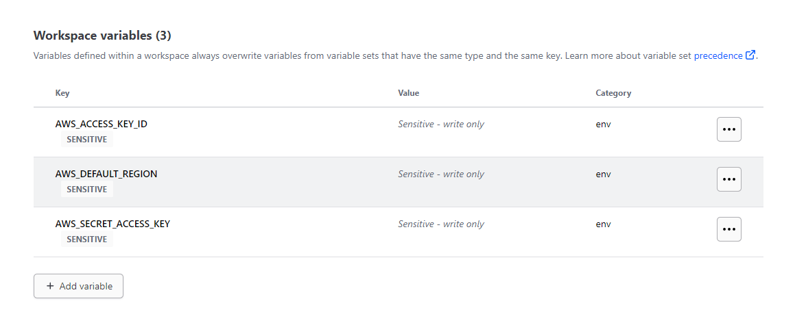

# Terraform Beginner Bootcamp 2023

## AWS

### Credentials and environment variables

For quick and secure access to the AWS environment, the credentials and cli preferences can be set as evironment variables.

After appending the following to the `~/.bash_profile` file using your favorite text editor.

```bash
export AWS_ACCESS_KEY_ID={KEY_ID_VALUE}
export AWS_SECRET_ACCESS_KEY={SECRET_KEY_VALUE}
export AWS_DEFAULT_REGION=eu-east-3
export AWS_CLI_AUTO_PROMPT=on-partial
```

Then to apply the changes without reopening the terminal, execute

```bash
source ~/.bash_profile
```


## Terraform cloud

### Workspace Variables

After migrating the tf state file to Terraform Cloud, the local environment variables are no longer accessible by the worker that will create, destroy or modify any infrastructure. Therefore, these variables must be declared on Terraform Cloud to make them available and avoid failing changes due to invalid / missing credentials.

On Terraform Cloud, after selecting the current workspace, head to the `Variables` section and add your Access Key.



### Terraform destroy and apply

After the AWS credentials were added in the Terraform Cloud Workspace, I performed a destroy and re-apply to test that everything is in place.


```bash
terraform destroy
```
This deleted the S3 bucket that was previously created, as well as the first randomly generated string which is a **managed resource** too.


```bash
terraform apply
```
This created a new S3 bucket with a different random suffix included in the name.


### Login Issue Fix

When trying to login to Terraform Cloud I discovered that all the login issues we faced with GitPod in the videos can be solved by pressing `CTRL+c`.
This was stopping the prompts and menus generated and just pointed to a prompt asking for the token.
After pasing, I go the **Successful login** message!
No need for workarounds or the additional bash script.


### File structure
`main.tf`, `variables.tf`, `outputs.tf`. These are the recommended filenames for a minimal module, even if they're empty. `main.tf` should be the primary entrypoint. For a simple module, this may be where all the resources are created. For a complex module, resource creation may be split into multiple files but any nested module calls should be in the main file. variables.tf and outputs.tf should contain the declarations for variables and outputs, respectively.

## Sources

* [Terraform Cloud - Managing Variables](https://developer.hashicorp.com/terraform/cloud-docs/workspaces/variables/managing-variables#workspace-specific-variables)
* [Terraform Command: Destroy](https://developer.hashicorp.com/terraform/cli/commands/destroy)
* [Terraform Command: Apply](https://developer.hashicorp.com/terraform/cli/commands/apply)
* [AWS Environment Variables](https://docs.aws.amazon.com/cli/latest/userguide/cli-configure-envvars.html)
* [Terraform Registry - random_string](https://registry.terraform.io/providers/hashicorp/random/latest/docs/resources/string)
* [Terraform Standard Module Structure](https://developer.hashicorp.com/terraform/language/modules/develop/structure)
